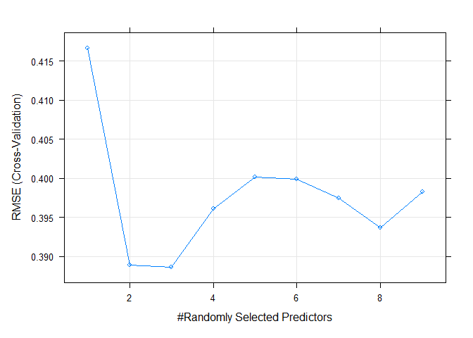

ST558 BlogPost4
================
Stephen Macropoulos
2023-07-20

``` r
#knitr::opts_chunk$set(fig.path = "/images/")

options(knitr.duplicate.label = "allow")

library(rmarkdown)
#rmarkdown::render("C:/Users/Owner/OneDrive/Documents/ST501/smacrop.github.io558/_Rmd/2023-07-20-ST558BPfour.Rmd",
#          output_format = "github_document",
#          output_dir = "C:/Users/Owner/OneDrive/Documents/ST501/smacrop.github.io558/_Rmd/",
#          output_options = list(keep_html=FALSE))
```

I thought the random forest models were very interesting. The random
forest idea uses same idea as bagging. It creates multiple trees from
bootstrap samples and averages the results. The main difference is that
we don’t use all our predictors but we use a random subset of predictors
for each bootstrap sample/tree fit instead. The reasoning behind this is
that if a really strong predictor exists, every bootstrap tree will
probably use it for the first split!

Let’s try it out on the iris data set!

``` r
library(caret)
irisIndex <- createDataPartition(iris$Sepal.Length, p = 0.2, list = FALSE)
irisTrain <- iris[irisIndex, ]
irisTest <- iris[-irisIndex, ]
rfFit <- train(Sepal.Length ~ ., data = irisTrain,
               method = "rf",
               trControl = trainControl(method = "cv",
                                        number = 5),
               tuneGrid = data.frame(mtry = 1:9))

pred <- predict(rfFit, newdata = irisTest)
postResample(pred, irisTest$Sepal.Length)
```

    ##      RMSE  Rsquared       MAE 
    ## 0.4119685 0.7447716 0.3213083

The root-mean-squared error, R-squared, and median absolute error stats
are produced from this random forest model fit for predicting the sepal
length variable using 5-fold cross-validation! Below is the RMSE vs \#
predictors plot:

``` r
plot(rfFit)
```

<!-- -->
